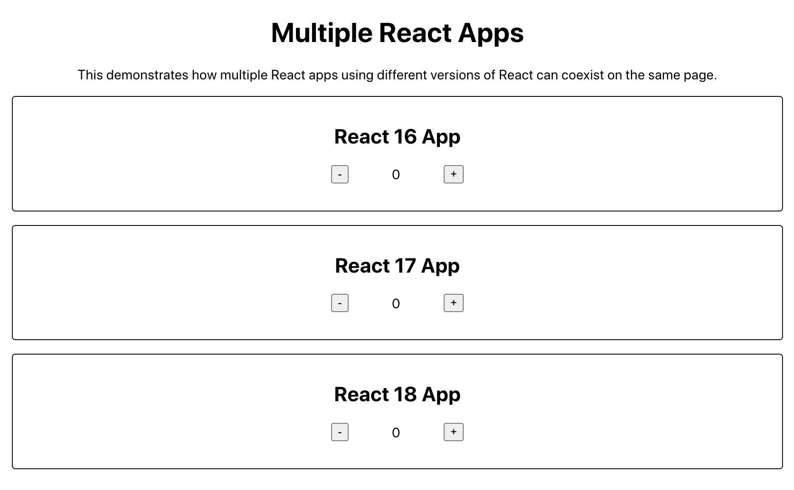

# React Multiple Versions

This demo app is used to test how having multiple versions of React on the same page causes the apps to behave.

## History

I've heard it said that you can run into issues when having multiple versions of React on the same page. For example, maybe you have one version of your app using React 16.7.0 and one version of your app using React 16.14.0.

Upon further inspection, this doesn't seem to be a problem anymore. The issue used to be with the Webpack runtime that gets injected on the page, since the callback function was always called `webpackJsonp`. So, the second app's runtime would override the first app's runtime. However, `react-scripts` was updated in August 2019 to append the name in `package.json` to the callback function name. This helps you avoid a naming collision as long as your two apps have different names in `package.json`. So for instance, your callback functions would be `webpackJsonpmy-app-1` and `webpackJsonpmy-app-2`.

Resources
- https://medium.jonasbandi.net/hosting-multiple-react-applications-on-the-same-document-c887df1a1fcd
- https://github.com/facebook/create-react-app/pull/5951/files
- https://reactjs.org/blog/2020/10/20/react-v17.html
- https://github.com/reactjs/react-gradual-upgrade-demo/

## Methodology

I have three apps in this repo

1. The first uses React 16
2. The second uses React 17
3. The third uses React 18

I run `yarn build` in each app directory to build each app and generate the three `build` directories.

I then copy the contents from each of the three `build/index.html` files and paste them into a root `index.html` file. I keep the CSS and JS for each app and include the three root `div` elements that each app renders into.

Then I use VS Code Live Server to run the `index.html` page in the browser on a local server.

(Any time you modify and build any of the React apps, you need to update your root `index.html` file. This is tedious and could likely be automated, but I haven't done so yet.)

With that, we now have three React apps running side by side on the page, all using different versions of React. Tada!
